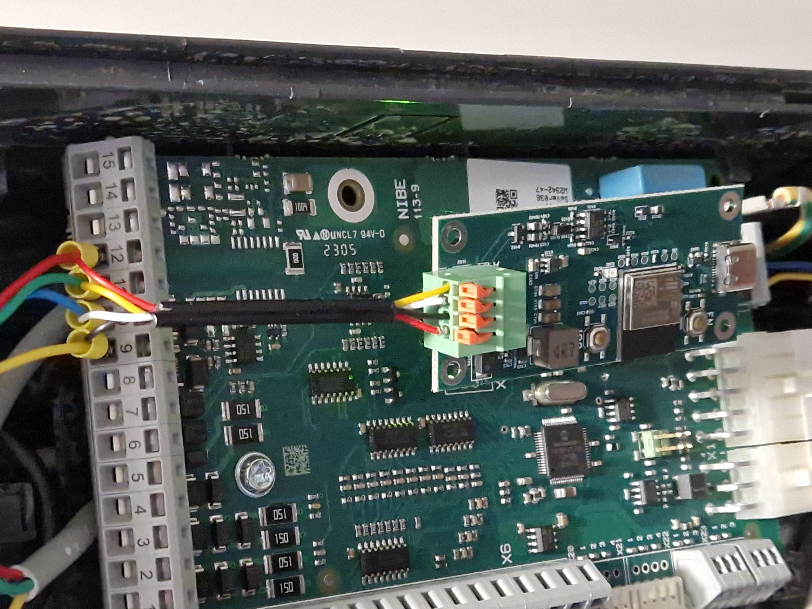
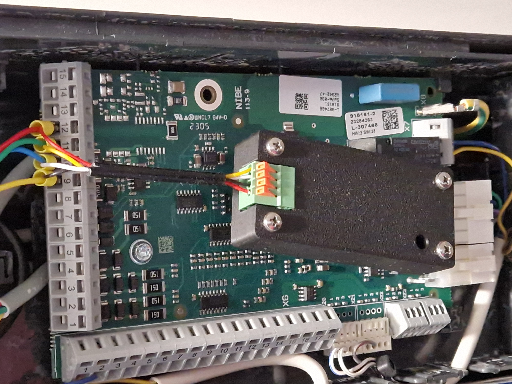

# esphome-Nibe_ESP32-C6

This project aims to get [nibegw for ESPHome](https://github.com/elupus/esphome-nibe) working on the ESP32-C6. A custom board for this purpose is available for purchase [here](https://www.tindie.com/products/39346/).

## Installing the Software

For instructions on running ESPHome on an ESP32-C6, please refer to [my other repository](https://github.com/IMMRMKW/ESPHome_ESP32-C6).  
This repository works similarly, but you should upload the YAML code found in `config.yml` here.

## Housing

Assembly instructions for the housing are available [on Thingiverse](https://www.thingiverse.com/thing:7088579).

## Electrical Connections

The 4-pin spring terminal connector is marked as follows:

| Pin     | Description                                |
|---------|--------------------------------------------|
| **Vin** | 12 V – 24 V input (max ~40 mA at 12 V)     |
| **GND** | Ground                                     |
| **B**   | RS485 line B                               |
| **A**   | RS485 line A                               |

## Connecting to Nibe F1255-6 R PC

Below are example images showing how to connect the board to a Nibe F1255-6 R PC.  
More information on using ESPHome with your Nibe is found [in this blog post](https://www.vanwerkhoven.org/blog/2023/nibe-heatpump-home-automation/).

