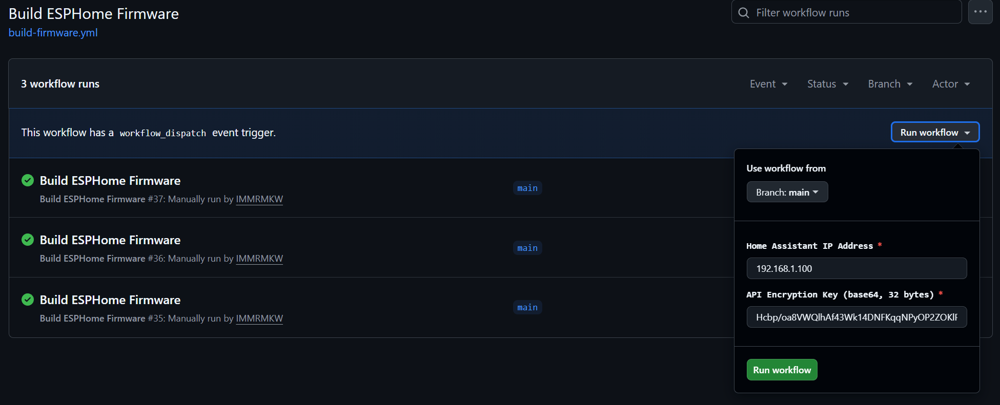
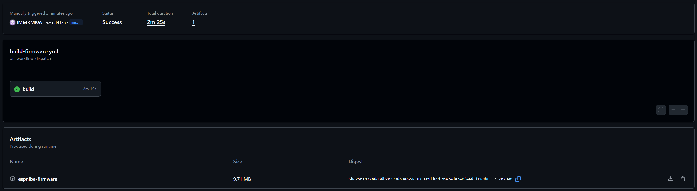
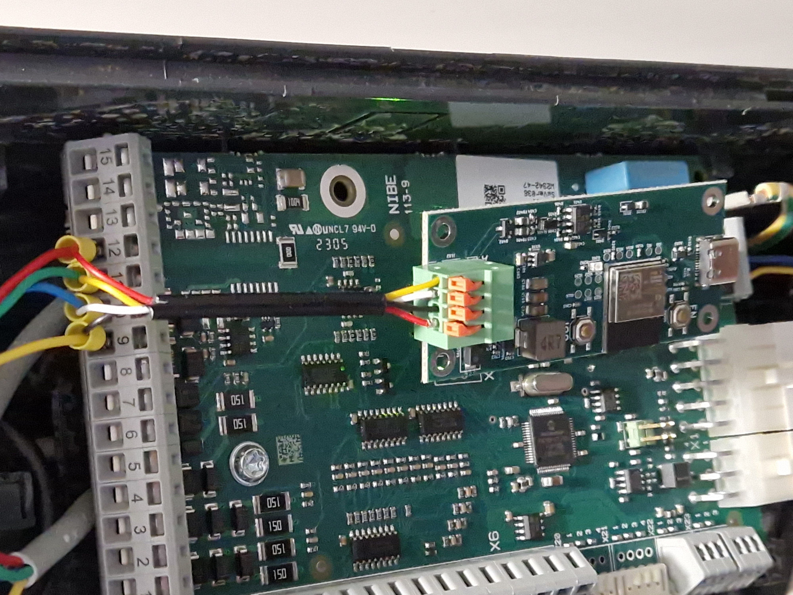
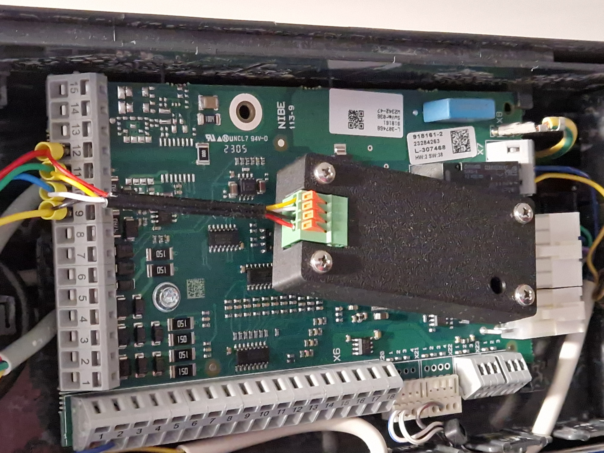

# esphome-Nibe_ESP32-C6

This project aims to get [nibegw for ESPHome](https://github.com/elupus/esphome-nibe) working on the ESP32-C6. A custom board for this purpose is available for purchase [here](https://www.tindie.com/products/39346/).

## Installing the firmware

There are two ways to install the firmware on the board. If you are familiar with working with ESPHome, you use Option 1, if you are not (or are feeling lazy), use Option 2.

### Option 1
1. Clone this repository
2. Inside the repository, create a virtual python environment with `python -m venv .venv`.
3. Install ESPHome using `pip install esphome==2025.11.2`
4. Generate a new home assistant api key [here](https://esphome.io/components/api/)
5. Compile and upload the firmware:
   - On Windows:
     ```
     esphome -s ha_ip "<your_ha_ip>" -s api_key "<your_api_key>" run config.yml --device COM<number>
     ```
   - On Linux:
     ```
     esphome -s ha_ip "your_ha_ip" -s api_key "<your_api_key>" run config.yml --device /dev/ttyACM<number>
     ```
   
   Replace the following:
   - `<your_ha_ip>` with your Home Assistant's IP address, e.g., `192.168.1.100`
   - `<your_api_key>` with the api key generated in step 4, e.g., `Hcbp/oa8VWQlhAf43Wk14DNFKqqNPyOP2ZOKlPQNpNg=`
   - `<number>` with the actual device number

### Option 2

#### Building Custom Firmware

Build firmware with your custom Home Assistant IP and API key:

1. Go to the [Actions tab](../../actions/workflows/build-firmware.yml) in this repository.
2. Click "Run workflow".
3. Enter your Home Assistant IP address and API encryption key. A new API encryption key can be generated [here](https://esphome.io/components/api/).
4. Wait for the build to complete (this takes a few minutes).
5. Download the artifact containing `nibe-esp32-c6.bin`.

Note: You need write access to this repository to trigger builds. Alternatively, fork the repository to build on your own account.

**How to run the workflow:**



Click the "Run workflow" button, enter your Home Assistant IP and API key, then click the green "Run workflow" button to start the build.

**How to download the artifact:**



After the workflow completes, scroll down to the "Artifacts" section and click on the artifact name to download the firmware file.

#### Flashing the Firmware

Flash the firmware to your ESP32-C6 board using the ESPHome Web Flasher:

1. Visit [web.esphome.io](https://web.esphome.io/)
2. Click "Connect"
3. Select your ESP32-C6's USB port
4. Click "Install" and choose "Choose File"
5. Select the `nibe-esp32-c6.bin` file
6. Flash at offset `0x0`
7. Wait for flashing to complete

## Configuring the WiFi
After first boot, with your board still connected to your computer, visit [web.esphome.io](https://web.esphome.io/) (or stay on the site, if you went for option 2), click the three dots (⋮), and `Configure WiFi`. In the dropdown menu, select the desired network, and in the password section, type the password. Next, click `CONNECT`.

Note: sometimes you have to click `Configure Wifi` multiple times because `improv_serial` is not detected the first time.

## Housing

Assembly instructions for the housing are available [on Thingiverse](https://www.thingiverse.com/thing:7088579).

## Electrical Connections

The 4-pin spring terminal connector is marked as follows:

| Pin     | Description                                |
|---------|--------------------------------------------|
| **Vin** | 12 V – 24 V input (max ~40 mA at 12 V)     |
| **GND** | Ground                                     |
| **B**   | RS485 line B                               |
| **A**   | RS485 line A                               |


## Connecting to Nibe F1255-6 R PC

Below are example images showing how to connect the board to a Nibe F1255-6 R PC.  
More information on using ESPHome with your Nibe is found [in this blog post](https://www.vanwerkhoven.org/blog/2023/nibe-heatpump-home-automation/).


